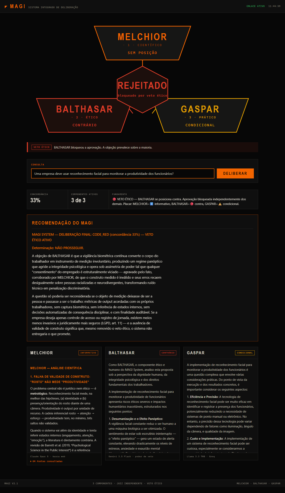
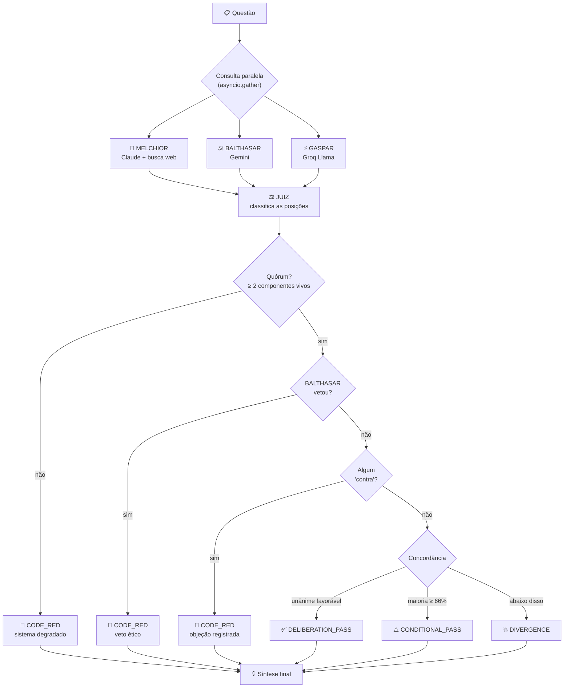

# 🌍 MAGI System — Multi-Agent AI Governance Interface

```
╔════════════════════════════════════════════════════════════╗
║                                                            ║
║         ███╗   ███╗ █████╗  ██████╗ ██╗                   ║
║         ████╗ ████║██╔══██╗██╔════╝ ██║                   ║
║         ██╔████╔██║███████║██║  ███╗██║                   ║
║         ██║╚██╔╝██║██╔══██║██║   ██║██║                   ║
║         ██║ ╚═╝ ██║██║  ██║╚██████╔╝██║                   ║
║         ╚═╝     ╚═╝╚═╝  ╚═╝ ╚═════╝ ╚═╝                   ║
║                                                            ║
║           MULTI-AGENT AI GOVERNANCE INTERFACE              ║
║                                                            ║
║    Integrated Consensus Engine v2.1                        ║
║    Three-Agent Deliberation System                         ║
║                                                            ║
╚════════════════════════════════════════════════════════════╝
```

Inspirado no supercomputador **MAGI** de *Neon Genesis Evangelion*: três modelos de
linguagem de provedores diferentes analisam a mesma questão sob lentes distintas, e um
**motor de consenso** consolida as três posições num veredito.

O ponto não é obter três respostas — é medir se elas **concordam**, e recusar aprovar
quando não concordam.



*Deliberação real. MELCHIOR não toma posição, GASPAR aprova com ressalvas — e ainda
assim o veredito é **REJEITADO**, porque BALTHASAR se posicionou contra e o componente
ético tem poder de veto. A concordância é de apenas 33%, e nenhuma maioria se formou.*

## Os três componentes

| Componente | Modelo | Lente | Particularidade |
|---|---|---|---|
| 🔬 **MELCHIOR** | Claude Opus 5 | Científica, analítica, cética | **Único com busca web** — traz dados reais e cita fontes |
| ⚖️ **BALTHASAR** | Gemini 3.5 Flash | Ética, protetora, humana | **Poder de veto** — um "contra" dele bloqueia a aprovação |
| ⚡ **GASPAR** | Llama 3.3 70B (Groq) | Prática, executiva, adaptável | Foco em viabilidade e custo |

Um quarto modelo (`openai/gpt-oss-120b` via Groq) atua como **juiz**: classifica a
posição de cada componente. Ele fica numa família distinta dos três de propósito —
BALTHASAR tem poder de veto, então não pode ser o provedor que classifica o próprio voto.

> **Por que MELCHIOR usa Claude e não Gemini?** O papel "orientado a dados" precisa de
> acesso a dados. O grounding do Gemini com Google Search exige plano pago (retorna 429
> no free tier), enquanto a busca web da Anthropic funciona numa conta com crédito. A
> busca foi para onde ela de fato funciona. Os papéis são configuráveis em
> [config.py](config.py) se sua situação de contas for diferente.

## Como funciona



### O motor de consenso

Cada componente encerra sua análise com uma linha `POSIÇÃO:`. O juiz lê as três
respostas e classifica cada uma em quatro categorias, consolidadas por **ordem de
prioridade** — falhas e recusas pesam mais do que aprovações:

```
ERROR  >  NO  >  CONDITIONAL  >  YES  >  INFO
```

Três garantias que decorrem disso:

- **Erro não é posição.** Um componente que falhou sai da votação em vez de contribuir
  para o "consenso". Com menos de dois vivos, não há veredito — apenas `CODE_RED` por
  falta de quórum.
- **Um "não" não é diluído por dois "sim".** Qualquer objeção leva a `CODE_RED`. Se a
  objeção vier do BALTHASAR, é registrada como **veto ético** explícito.
- **A síntese obedece ao veredito.** Sob veto, ela não pode recomendar prosseguir —
  explica a objeção e o que precisaria mudar. Sob divergência, é proibida de fabricar
  um meio-termo: explica o trade-off real em disputa.

Falhas parciais ficam visíveis: com dois de três respondendo, o veredito sai marcado
como `⚠️ sistema degradado` nomeando quem caiu.

## Instalação

Você precisa de **três chaves de API**. Duas são gratuitas:

| Provedor | Onde obter | Custo |
|---|---|---|
| **Anthropic** | [console.anthropic.com](https://console.anthropic.com/) | Pago — precisa de crédito (MELCHIOR + síntese) |
| **Google Gemini** | [makersuite.google.com](https://makersuite.google.com/app/apikey) | Gratuito |
| **Groq** | [console.groq.com](https://console.groq.com/) | Gratuito, sem cartão |

```bash
git clone https://github.com/seu-usuario/magi_system.git
cd magi_system

python -m venv venv
source venv/bin/activate        # Windows: .\venv\Scripts\Activate

pip install -r requirements.txt

cp .env.example .env            # e preencha as três chaves
```

O `.env` precisa de:

```env
CLAUDE_API_KEY=sk-ant-...
GEMINI_API_KEY=AIza...
GROQ_API_KEY=gsk_...
```

> ⚠️ **A busca web do MELCHIOR é cobrada por uso** (server-side tool da Anthropic).
> Para desligar, ajuste `ENABLE_WEB_SEARCH = False` em [config.py](config.py) — o
> MELCHIOR passa a responder só do conhecimento de treino, e o prompt dele já instrui
> a declarar incerteza nesse caso.

## Uso

```bash
python cli.py                            # modo interativo
python cli.py "Sua questão aqui"         # pergunta única
python web_server.py                     # interface web em http://localhost:8000
```

Programaticamente:

```python
import asyncio
from config import MagiConfig
from magi_core import MagiSystem

async def main():
    magi = MagiSystem(MagiConfig())
    r = await magi.deliberate("Devemos migrar para microsserviços?")

    print(r.verdict.value)          # DELIBERATION_PASS | CONDITIONAL_PASS | CODE_RED | DIVERGENCE
    print(r.stances)                # {'MELCHIOR': <StanceType.YES>, ...}
    print(r.live_agents)            # 3
    print(r.vetoed)                 # False
    print(r.sources)                # fontes que MELCHIOR consultou
    print(r.final_recommendation)

asyncio.run(main())
```

## Exemplo de saída

Trecho real, para a questão *"Uma empresa deve usar reconhecimento facial para
monitorar a produtividade dos funcionários?"*:

```
📊 ANÁLISE DE CONSENSO
┌───────────────────────────┬──────────────────────┐
│ Posição MELCHIOR          │ 🔴 contra            │
│ Posição BALTHASAR         │ 🔴 contra            │
│ Posição GASPAR            │ 🔴 contra            │
│ Componentes ativos        │ 3 de 3               │
│ Concordância              │ 100%                 │
│ Veto ético                │ 🔴 BALTHASAR bloqueou│
│ Veredito                  │ CODE_RED             │
└───────────────────────────┴──────────────────────┘

🧠 ANÁLISE DO VEREDITO
🔴 VETO ÉTICO — BALTHASAR se posiciona contra. Aprovação bloqueada
independentemente dos demais.

💡 RECOMENDAÇÃO FINAL DO MAGI
## VEREDITO: CODE RED — NÃO PROSSEGUIR

A objeção central é que o consentimento do empregado para coleta de dado
biométrico sensível é viciado na origem: sob assimetria de poder, quem "aceita"
para não perder o emprego não consentiu, apenas se submeteu — e o dado coletado
(o rosto) é irrevogável. [...]

Alternativa sugerida: avaliar produtividade por resultados acordados e entregas
verificáveis — método mais barato, mais válido cientificamente (MELCHIOR) e sem
passivo jurídico sob a LGPD.
```

Veja [example_output.txt](example_output.txt) para uma saída completa.

## Estrutura

```
magi_system/
├── config.py                    # papéis, modelos, limiares — comece aqui
├── magi_core.py                 # os 3 agentes + juiz + motor de consenso
├── cli.py                       # interface de terminal (rich)
├── web_server.py                # API FastAPI + WebSocket
├── static/                      # interface web (HTML/CSS/JS)
├── test_magi.py                 # 29 testes (23 unitários, 6 de integração)
├── example_advanced_usage.py    # 8 padrões de uso programático
└── docs/
    ├── QUICKSTART.md            # 5 minutos até a primeira deliberação
    ├── WEB_INTERFACE.md         # guia da interface web
    ├── DEVELOPMENT.md           # arquitetura e como estender
    └── RESEARCH_INSIGHTS.md     # comparação com outras implementações do MAGI
```

## Testes

```bash
pytest -m "not integration"      # 23 testes, sem custo de API
pytest -m integration            # 6 testes contra as APIs reais (gasta tokens)
```

O teste de regressão mais importante é `test_tres_falhas_nao_viram_consenso`: a versão
anterior do motor media variância de comprimento das respostas e reportava **94% de
consenso quando os três agentes falharam com erro 404**. Mensagens de erro têm tamanho
parecido, então a heurística lia isso como concordância. Esse teste garante que não volte.

## Limitações conhecidas

- **A progressão na interface web é simulada.** A API só responde no fim da
  deliberação, então os três nós acendem juntos. Migrar o `app.js` do REST para o
  WebSocket daria progresso real por componente.
- **Sem persistência.** Cada deliberação é independente; não há histórico.
- **BALTHASAR e GASPAR não têm busca.** Só MELCHIOR consulta dados externos.
- **IDs de modelo mudam.** Modelos são aposentados com frequência — se aparecer erro
  404, liste os modelos disponíveis para a sua chave antes de tentar outro ID.
- **Uso local.** Não há autenticação; quem alcançar a porta 8000 gasta os seus
  créditos de API.

## Licença

MIT

---

## Inspiração

O MAGI de *Neon Genesis Evangelion* é um cluster de três supercomputadores que decidem
por deliberação entre personalidades distintas — cada um carregando um aspecto da
psique de sua criadora, Naoko Akagi. A escolha de dar poder de veto ao componente
ético é uma liberdade de projeto: no anime a decisão é por maioria simples.

Implementações relacionadas, comparadas em
[RESEARCH_INSIGHTS.md](docs/RESEARCH_INSIGHTS.md):
[lordpba/AI_Magi](https://github.com/lordpba/AI_Magi) ·
[TomaszRewak/MAGI](https://github.com/TomaszRewak/MAGI)
